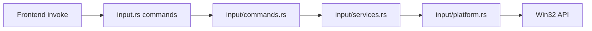

# input 模块架构说明

本文档描述 `src-tauri/src/input` 的当前分层设计、调用链、平台差异与性能要点。

## 1. 分层结构

- `src-tauri/src/input.rs`
  - 模块门面（facade）。
  - 仅保留 `#[tauri::command]` 入口，保证 `generate_handler!` 可见性。
- `src-tauri/src/input/commands.rs`
  - 命令薄封装：参数接收 + 调用 service。
- `src-tauri/src/input/services.rs`
  - 业务编排：粘贴节奏控制、跨平台流程分派。
- `src-tauri/src/input/platform.rs`
  - 平台细节：Win32 API、剪贴板 CF_HDROP、文件图标提取、Shell 打开/定位。

## 2. 调用关系

## 3. 命令与职责映射

- `paste_text`
  - `services` 层实现窗口隐藏、焦点切换等待与模拟粘贴。
- `click_and_paste`
  - `services` 层实现点击后粘贴节奏；Windows 下附加鼠标点击。
- `copy_file_to_clipboard`
  - `platform` 层实现 CF_HDROP（Windows）；非 Windows 返回占位错误。
- `open_file`
  - Windows 使用 `ShellExecuteW("open")`；macOS/Linux 使用系统命令。
- `open_file_location`
  - Windows 优先 `SHOpenFolderAndSelectItems`，失败回退 `explorer /select`。
- `get_file_icon`
  - Windows 在 `spawn_blocking` 中执行 GDI + PNG 编码；非 Windows 返回 `None`。

## 4. 内存与性能策略

- 图标提取是阻塞型 CPU/GDI 工作，已转为 `spawn_blocking`，避免占用 async worker。
- 后端图标缓存：`platform.rs` 内 `Mutex + HashMap + VecDeque`，容量上限 `256`。
- 前端图标缓存（`src/components/FileListDisplay.tsx`）已加容量上限与近似 LRU 刷新策略。
- 剪贴板 CF_HDROP 分支在失败路径补充内存释放，降低异常分支泄漏风险。

## 5. 日志与隐私策略

- `format_sensitive_path_for_log`：
  - `debug` 构建：输出完整路径（便于排障）。
  - `release` 构建：输出 `<basename:xxx.ext>`（隐藏目录层级）。
- `open_file`、`open_file_location`、`copy_file_to_clipboard` 已统一使用该策略。

## 6. 维护约定

- 新增 Tauri 命令：优先在 `input.rs` 声明入口，再下沉到 `commands/services/platform`。
- 新增 Windows API：集中放在 `platform.rs`，并补充失败回退路径。
- 涉及路径日志：禁止直接打完整路径，统一走 `format_sensitive_path_for_log`。
