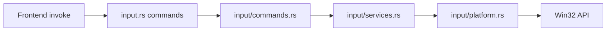

# input 模块架构说明

本文档描述 `src-tauri/src/input` 的当前分层设计、调用链、平台差异与性能要点。

## 1. 分层结构

- `src-tauri/src/input.rs`
  - 模块门面（facade）。
  - 仅保留 `#[tauri::command]` 入口，保证 `generate_handler!` 可见性。
- `src-tauri/src/input/commands.rs`
  - 命令薄封装：参数接收 + 调用 service。
- `src-tauri/src/input/services.rs`
  - 业务编排：粘贴节奏控制、跨平台流程分派。
- `src-tauri/src/input/platform.rs`
  - 平台细节：Win32 API、剪贴板 CF_HDROP、文件图标提取、Shell 打开/定位。

## 2. 调用关系

```mermaid
flowchart LR
  UI[Frontend invoke] --> C[input.rs commands]
  C --> CMD[input/commands.rs]
  CMD --> SVC[input/services.rs]
  SVC --> PF[input/platform.rs]
  PF --> WIN[Win32 API]
```

## 3. 命令与职责映射

- `paste_text`
  - `services` 层：窗口隐藏（`hide_windows`）、焦点等待（`FOCUS_SETTLE_MS`）、模拟粘贴（`simulate_paste`）。
- `click_and_paste`
  - `services` 层：隐藏窗口 → 焦点等待 → 鼠标点击（仅 Windows）→ 点击等待（`CLICK_SETTLE_MS`）→ 模拟粘贴。
- `copy_file_to_clipboard`
  - `platform` 层实现 CF_HDROP（Windows）；非 Windows 返回占位错误。
- `open_file`
  - `platform` 层：Windows 使用 `ShellExecuteW("open")`；macOS `open`；Linux `xdg-open`。
- `open_file_location`
  - `platform` 层：Windows 优先 `SHOpenFolderAndSelectItems`，失败回退 `explorer /select`；macOS `open -R`；Linux `xdg-open` 父目录。
- `get_file_icon`
  - `platform` 层：Windows 在 `spawn_blocking` 中执行 GDI + PNG 编码；非 Windows 返回 `None`。

### services 层内部辅助

| 函数 | 职责 |
|---|---|
| `create_enigo()` | 统一创建 `Enigo` 实例并映射错误 |
| `hide_windows(app)` | 隐藏主窗口 + 所有 HUD 窗口 |
| `simulate_paste(enigo)` | 模拟系统粘贴快捷键（macOS ⌘V / 其它 Ctrl+V） |

| 常量 | 值 | 含义 |
|---|---|---|
| `FOCUS_SETTLE_MS` | 300 | 窗口隐藏后等待目标窗口获焦 |
| `CLICK_SETTLE_MS` | 100 | 鼠标点击后等待焦点稳定 |

## 4. 内存与性能策略

- 图标提取是阻塞型 CPU/GDI 工作，已转为 `spawn_blocking`，避免占用 async worker。
- 后端图标缓存：`platform.rs` 内 `Mutex + lru::LruCache`（O(1) get/put），容量上限 `256`。
  - 同时缓存 `Some`（成功提取）和 `None`（无图标），避免对不存在图标的重复 GDI + I/O 开销。
- 前端图标缓存（`src/components/FileListDisplay.tsx`）已加容量上限与近似 LRU 刷新策略。
- 所有 Win32 资源均通过 RAII Guard 自动释放，消除手动 cleanup 的泄漏风险：
  - `ComGuard`：COM STA apartment（`CoInitializeEx` / `CoUninitialize`）。
  - `PidlGuard`：Shell PIDL 内存（`CoTaskMemFree`）。
  - `ClipboardSession`：剪贴板会话（`OpenClipboard` / `CloseClipboard`）。
  - `ScreenDcGuard` / `MemDcGuard`：GDI DC（`ReleaseDC` / `DeleteDC`）。
  - `BitmapGuard` / `SelectionGuard`：GDI 位图与选入对象。
  - `IconGuard`：HICON（`DestroyIcon`）。
- 图标双通道 alpha 恢复中，白底渲染结果直接借用 DIB 缓冲区切片（不复制），节省一次 `Vec` 分配。
- PNG 编码输出预分配 4KB，减少小图标场景的 `Vec` 扩容次数。

## 5. 日志与隐私策略

- `log_path`（原 `format_sensitive_path_for_log`，已重命名精简）：
  - `debug` 构建：输出完整路径（便于排障）。
  - `release` 构建：输出 `<basename:xxx.ext>`（隐藏目录层级）。
- `open_file`、`open_file_location`、`copy_file_to_clipboard` 已统一使用该策略。

## 6. 维护约定

- 新增 Tauri 命令：优先在 `input.rs` 声明入口，再下沉到 `commands/services/platform`。
- 新增 Windows API：集中放在 `platform.rs`，并补充失败回退路径。
- 新增 Win32 资源：必须使用 RAII Guard 封装，禁止裸资源手动释放。
- 涉及路径日志：禁止直接打完整路径，统一走 `log_path`。
- 画刷等一次性 GDI 资源：使用 `fill_rect_color` 等辅助函数封装创建/使用/销毁生命周期。
